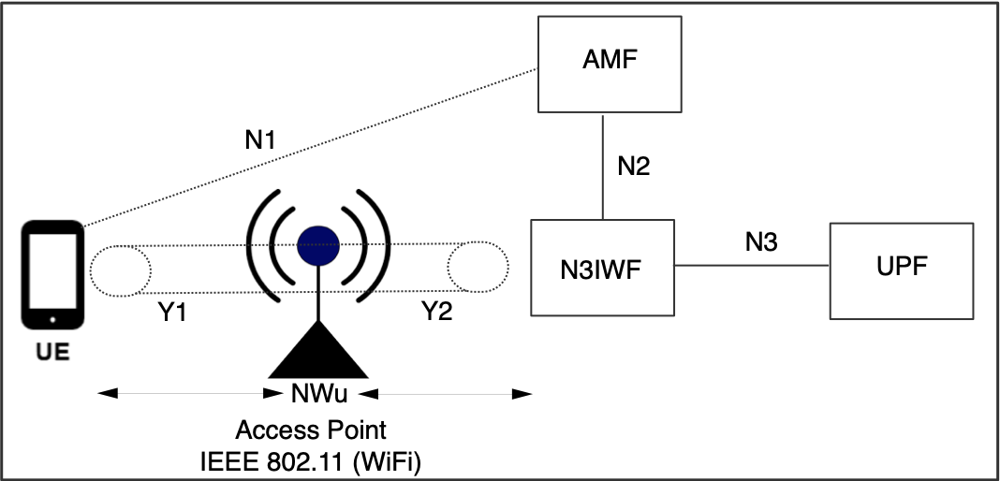
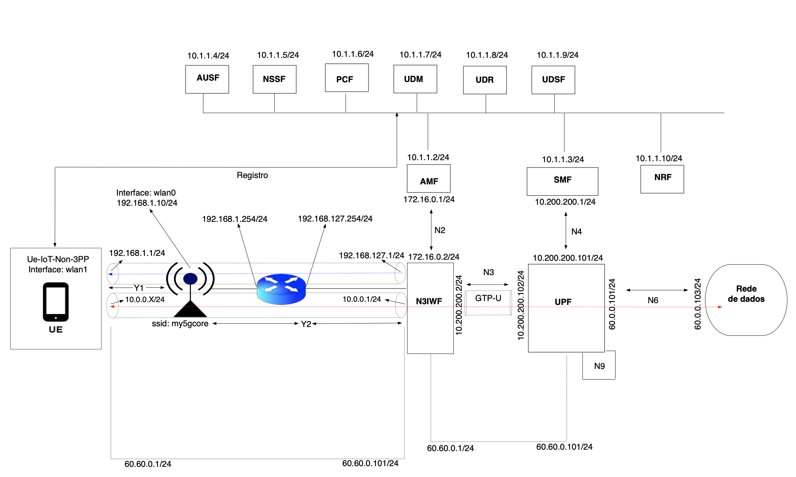
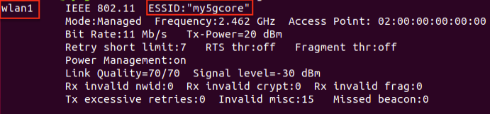
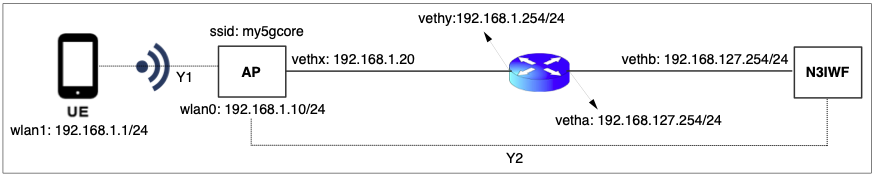
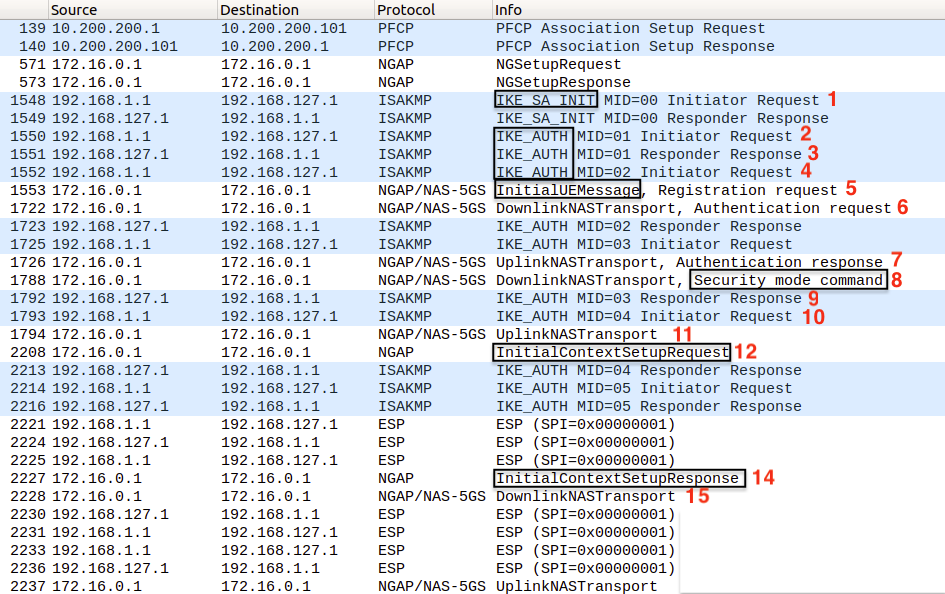
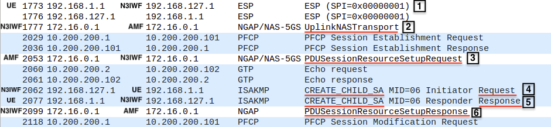
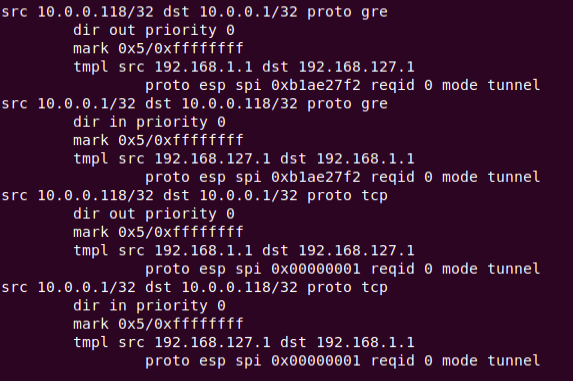

<div align="center">
    <a href="https://github.com/LABORA-INF-UFG/my5Gcore"></a>
</div> 

# Non-3GPP-WiFi use-case

<!-- START doctoc generated TOC please keep comment here to allow auto update -->
<!-- DON'T EDIT THIS SECTION, INSTEAD RE-RUN doctoc TO UPDATE -->
# Table of contents  

- [Description](#description)
- [Recommended environment](#recommended-environment)
- [Prerequisite](#prerequisite)
- [Expected result](#expected-result)
- [A. Y1 Interface - Conection between UE-non3GPP and AP](#a-y1-interface---conection-between-ue-non3gpp-and-ap)
  - [1) Setting-up environment](#1-setting-up-environment)
  - [2) Check connection between UE-non3GPP and AP](#2-check-connection-between-ue-non3gpp-and-ap)
- [B. Y2 Interface - Conection between AP and N3IWF](#b-y2-interface---conection-between-ap-and-n3iwf)
  - [1) Setting-up environment](#1-setting-up-environment-1)
  - [2) Setting namespaces, interfaces and routes for the scenario](#2-setting-namespaces-interfaces-and-routes-for-the-scenario)
  - [3) Starting monitoring tools](#3-starting-monitoring-tools)
  - [4) Starting UPF](#4-starting-upf)
  - [5) Running the other NFs in my5G-core network](#5-running-the-other-nfs-in-my5g-core-network)
  - [6) Starting UE-non3GPP](#6-starting-ue-non3gpp)
  - [7) Triggering initial registration procedure](#7-triggering-initial-registration-procedure)
- [C. Discussion](#c-discussion)
  - [1) Registration, authentication and authorization](#1-registration-authentication-and-authorization)
  - [2) PDU session establishment](#2-pdu-session-establishment)
- [D. Tests](#d-tests)
  - [1) Check associations between UE-non3GPP and N3IWF](#1-check-associations-between-ue-non3gpp-and-n3iwf)
    - [1.1) XFRM policy](#11-xfrm-policy)
    - [1.2) XFRM state](#12-xfrm-state)
  - [2) Check connectivity between UE-non3GPP and Data Plane (UPF)](#2-check-connectivity-between-ue-non3gpp-and-data-plane-upf)
    - [2.1) Ping to 60.60.0.101](#21-ping-to-60600101)
    - [2.2) MTR analysis](#22-mtr-analysis)
  - [3) Check conectivity between UE-non3GPP and Data Plane (Internet)](#3-check-conectivity-between-ue-non3gpp-and-data-plane-internet)
    - [3.1) Ping to 8.8.8.8](#31-ping-to-8888)
    - [3.2) MTR analysis](#32-mtr-analysis)
- [E. Cleanning-up environment](#e-cleanning-up-environment)
- [F. Troubleshooting](#f-troubleshooting)
  - [1) To create gtp5g module](#1-to-create-gtp5g-module)
  - [2) Pings tests failed](#2-pings-tests-failed)

<!-- END doctoc generated TOC please keep comment here to allow auto update -->

## Description
Non-3GPP-WiFi use-case aims to demonstrate the untrusted non-3GPP access to the my5G-core using a IEEE 802.11 network (WiFi) as illustrated by the following image.

<p align="center">
     
</p>

## Recommended environment

Non-3GPP-Wi-Fi use-case  has been tested against the following environment:

- Software
    - OS: Ubuntu 18.04
    - kernel version 5.0.0-23-generic
    - my5G-core v3.0.4
    - UE-non3GPP v0.0.1
    - gtp5g v0.2.0
    

The listed kernel version is required for the UPF element.

- Minimum Hardware
    - CPU: Intel i5 processor
    - RAM: 4GB
    - Hard drive: 30GB
    - NIC: Any 1Gbps Ethernet card supported in the Linux kernel

- Recommended Hardware
    - CPU: Intel i7 processor
    - RAM: 8GB
    - Hard drive: 160GB
    - NIC: Any 10Gbps Ethernet card supported in the Linux kernel

## Prerequisite

This guide assumes that you will run all 5GC elements on a single machine and that [my5G-core](https://github.com/my5G/my5G-core) and [UE-non3GPP](https://github.com/my5G/UE-IoT-non3GPP) are already installed in ~/my5G-core and ~/my5G-core/src/ue, respectivaly.

## Expected result

This experiment aims to demonstrate a non-3GPP access based on N3IWF (Non-3GPP Interworking Function) with integrated a IEEE 802.11 network implemented by mac80211_hwsim and using hostapd and 
wpa\_supplicant tools. We also use an open-source implementation of the 
SBA-based 5G core software ([my5G-core](https://github.com/my5G/my5G-core)), and 
an open-source implementation to provide untrusted non-3GPP access do 5G core network
([UE-non3GPP](https://github.com/my5G/UE-IoT-non3GPP)). Y1 interface is responsible for the connection
between User Equipment (UE-non3GPP) and Access Point (AP) and Y2 establishes connection between AP and N3IWF.

The network architecture is shown in figure below. A UE-non3GPP accessing the 5GCN through an untrusted WLAN (my5gcore) shall support NAS signalling and shall initially register and authenticate with the 5GCN using the N3IWF and N1 interface. The component of core - AMF (Access and Mobility Management Function) - is used to register the UE-non3GPP and the AUSF (Authentication Server Function) is used to authenticate the UE-non3GPP. The UE-non3GPP shall establish PDU sessions using the IPsec signalling SA using the NAS session management messages with the SMF (Session Management Function) via the AMF. The transfer of data packets between the UE-non3GPP and Data Network (DN) uses the secure IPsec tunnel between UE-non3GPP and N3IWF and the GTP-U tunnel between N3IWF and UPF (User Plane Function).

<p align="center">
     
</p>

## A. Y1 Interface - Conection between UE-non3GPP and AP

### 1) Setting-up environment
On your host, install the necessary packages:

```bash
sudo apt-get update && sudo apt-get install dnsmasq hostapd wget -y
```

To create wlan0 and wlan1 wireless cards with mac80211_hwsim:

```bash
sudo modprobe mac80211_hwsim radios=2
```
The argument radios=2 defines how many virtual interfaces will be created and 
defaults to two devices. After successfully loading the kernel module, wlan0 and wlan1 
are showing up, as shown in figure below (execute iwconfig). 
The third interface that pops up is hwsim0 that is a virtual interface for 
debugging purposes, where you could listen to all radio frames on all channels. 
We won’t need it for this guide.

<p align="center">
     
</p>

We are going to create network namespaces: i) **APns** for interface wlan0 and ii) **UEns** for  interface wlan1.

To create a network namespace for UEns and APns:

```bash
sudo ip netns add APns
sudo ip netns add UEns
```

In other terminal, type:
```bash
# Run this in a separate shell.
sudo ip netns exec APns bash
echo $BASHPID
```
The resulted expected is like below. 
In this tutorial, the bash pid is 3065 (in your case, it will be another number)

<p align="center">
     
</p>

At the first terminal, type:

```bash
# Run this command with your bash pid instead of 3065
sudo iw phy phy0 set netns 3065 # you must have to change the bash pid (APns)
```

In other terminal, type:
```bash
# Run this in a separate shell.
sudo ip netns exec UEns bash
echo $BASHPID
```

At the first terminal, type:

```bash
# Run this command with your bash pid instead of 3065
sudo iw phy phy1 set netns 3065 # you must have to change the bash pid (UEns)
```

At this point, wlan0 interface is in APns namespace and wlan1 at UEns namespace. Note in the figure that wlan0 is isolated.

<p align="center">
     
</p>

Apply the settings for wlan0:

```bash
sudo ip netns exec APns ip addr add 192.168.1.10/24 dev wlan0
```

To create the dnsmasq.conf file:
```bash
sudo killall dnsmasq
sudo touch $HOME/dnsmasq.conf && sudo chmod 666 $HOME/dnsmasq.conf
echo -e "interface=wlan0\ndhcp-range=192.168.1.2,192.168.1.254,255.255.255.0,12h\nserver=8.8.8.8\nlog-queries\nlog-dhcp\nlisten-address=127.0.0.1\ndhcp-host=02:00:00:00:01:00,192.168.1.1" > $HOME/dnsmasq.conf

```
<br>

Or download the dnsmasq.conf file from the repository:

```bash
cd ~
wget -O dnsmasq.conf https://raw.githubusercontent.com/mariotlemes/non-3gpp-iot-wifi/master/conf/dnsmasq.conf?token=ACYGK3SQCFMVALNY7W5Y7M3AAWKZO
```
<br>

Initializing dnsmasq.conf:

```bash
cd ~
sudo ip netns exec APns dnsmasq -C $HOME/dnsmasq.conf -D
```

To create the hostapd.conf file:

```bash
sudo touch $HOME/hostapd.conf && sudo chmod 666 $HOME/hostapd.conf
echo -e "interface=wlan0\ndriver=nl80211\nssid=my5gcore\nchannel=0\nhw_mode=b\nwpa=3\nwpa_key_mgmt=WPA-PSK\nwpa_pairwise=TKIP CCMP\nwpa_passphrase=my5gcore\nauth_algs=3\nbeacon_int=100" > $HOME/hostapd.conf
```
<br>

Or download the hostapd.conf file from the repository:

```bash
cd ~
wget -O hostapd.conf https://raw.githubusercontent.com/mariotlemes/non-3gpp-iot-wifi/master/conf/hostapd.conf?token=ACYGK3TYEKDKTDWH7KVNHV3AAWKX4
```
<br>

Initializing hostapd.conf to wlan0. At the end of this process, wlan0 will become an access point:

```bash
cd ~
sudo ip netns exec APns hostapd hostapd.conf -B
```
The expected result is like below:

<p align="center">
     
</p>

To create the wpa_supplicant.conf file:

```bash
  cd ~
  sudo touch wpa_supplicant.conf && sudo chmod 666 wpa_supplicant.conf
  echo -e 'network={\nssid="my5gcore"\nkey_mgmt=WPA-PSK\npsk="my5gcore"\n}' > wpa_supplicant.conf
```
<br>

Or download the wpa_supplicant.conf file from the repository:

```bash
cd ~
wget -O wpa_supplicant.conf https://raw.githubusercontent.com/mariotlemes/non-3gpp-iot-wifi/master/conf/wpa_supplicant.conf?token=ACYGK3RD4FRCJKW7NOGDXGLAAWK22
```
<br>

Apply the settings for wlan1:

```bash
cd ~
sudo killall wpa_supplicant
sudo ip netns exec UEns wpa_supplicant -i wlan1 -c wpa_supplicant.conf -B 
sudo ip netns exec UEns dhclient wlan1
```

To remove the default route from UE-non3GPP, do:

```bash
sudo ip netns exec UEns route del -net 0.0.0.0 gw 192.168.1.10 netmask 0.0.0.0 dev wlan1
```
### 2) Check connection between UE-non3GPP and AP

At this point, the virtual interface wlan1 (ip address 192.168.1.1/24) is connected to wlan0 (ip address 192.168.1.10/24) which acts as a WiFi access point. 

```bash
sudo ip netns exec UEns iwconfig
```

If success, the output of the command above will be like
below:

<p align="center">
     
</p>

You can also check the IP address configuration of wlan1 interface.

```bash
sudo ip netns exec UEns ip addr show wlan1
```

The ip add address of the wlan1 interface must be 192.168.1.1/24.

<p align="center">
     
</p>


## B. Y2 Interface - Conection between AP and N3IWF

The connection between AP and N3IWF will be made by veth (virtual ethernet) and the AP will be able to able to route messages between UE-non3GPP and N3IWF. The ip addressing for the logical interface Y2 and the virtual interfaces are shown in the figure below:

<p align="center">
     
</p>

### 1) Setting-up environment

```bash
# Clone the repository
cd ~
git clone https://github.com/mariotlemes/non-3gpp-iot-wifi.git

# Enable forwarding, stop ufw, install module gtp5g and add rule on iptables 
cd ~/non-3gpp-iot-wifi
sudo ./utils/fix_core.sh
 
# Backup of the config folder
cd ~/my5G-core
mv -f config config.orig

# Using sample1 folder for configuration
cp -R sample/sample1/ config

# Backup of upf config
mv -f src/upf/build/config/upfcfg.yaml src/upf/build/config/upfcfg.yaml.orig

# New configuration for upf
cp src/upf/config/upfcfg.sample1.yaml src/upf/build/config/upfcfg.yaml

# set UE-non3GPP http bind address 
sed -i 's/HttpIPv4Address: .*/HttpIPv4Address: 192.168.1.1/' config/uecfg.conf

# Remove database due to previews tests
mongo free5gc --eval "db.dropDatabase()"

# Run webconsole
go build -o bin/webconsole -x webconsole/server.go
./bin/webconsole &

# Add the UE-non3GPP that will be used in the test
~/my5G-core/sample/sample1/utils/add_test_ue.sh
```

### 2) Setting namespaces, interfaces and routes for the scenario
```bash
# Backup env_manager.sh file
cd ~/my5G-core/sample/sample1/utils
mv env_manager.sh env_manager.sh-ori

# Copy the env_manager.sh file from the repository
sudo cp ~/non-3gpp-iot-wifi/utils/env_manager.sh ~/my5G-core/sample/sample1/utils/

# Setup network interfaces and namespaces
./env_manager.sh up $(ip route | grep default | cut -d' ' -f5)
```

### 3) Starting monitoring tools

```bash
# Wireshark for global namespace
wireshark -kni any --display-filter "isakmp or nas-5gs or ngap or pfcp or gtp or esp or gre" &

# Wireshark for UEns (wlan1)
sudo ip netns exec UEns wireshark -kni wlan1 --display-filter "isakmp or esp" &
```

### 4) Starting UPF
```bash
# Use a new terminal so we can easily see the logs
cd ~/my5G-core/sample/sample1/utils
./run_upf.sh 
```
### 5) Running the other NFs in my5G-core network
Run the components of core in this order: **NFR**->**AMF**->**SMF**->**UDR**->**PCF**->**UDM**->**NSSF**->**AUSF**->**N3IWF**.  

For example, to run NRF:
```bash
cd ~/my5G-core
./bin/nrf &
```
Repeat the process to AMF, SMF, UDR, PCF, UDM, NSSF and AUSF. 

Finally, to run N3IWF:
```bash
cd ~/my5G-core
sudo ./bin/n3iwf 
```

### 6) Starting UE-non3GPP
```bash
# Use a new terminal or split
cd ~/my5G-core/

# Starting UE-non3GPP
sudo ip netns exec UEns ./bin/ue
```

### 7) Triggering initial registration procedure
```bash
# New ike_bind_addr 
sed -i 's/ike_bind_addr=.*/ike_bind_addr=${ike_bind_addr:-"192.168.1.1"}/' ~/my5G-core/src/ue/trigger_initial_registration.sh 

# Starting the initial registration procedure
sudo ip netns exec UEns ~/my5G-core/src/ue/trigger_initial_registration.sh --ue_addr 192.168.1.1 --ue_port 10000 --scheme http
```
<br>

## C. Discussion

At this point, we created 2 (two) wireless network interfaces with the mac80211_hwsim module. The interface wlan0 was instantiated in a namespace "APns" and wlan1 in the namespace "UEns". Dnsmasq was used to provide ip addressing service to hosts connected to the "my5gcore", emulated by the wlan0 interface with hostapd.

In order to register to the 5G Core Network (5GCN) via untrusted non-3GPP IP access, the UE-non3GPP first needs to be configured with a local IP address from the untrusted non-3GPP access network. With the wpa_supplicant tool, we connected the wlan1 interface to the IEEE 802.11 network (WiFi).

After instantiating the customized scenario (addressing each Network Function (NF), registering the UE-non3GPP to the core and setting up the scenario with namespaces, virtual interfaces and routes), we started all 5G core NFs and the UE-non3GPP. Finally, we started the initial registration process to UE-non3GPP proceeds with the registration, authentication and authorization procedures to access the 5GCN.


### 1) Registration, authentication and authorization

The registration, authentication and authorization procedures are show in figure below:

<p align="center">
     
</p>

**1)** UE-non3GPP initiates the IKEv2/ISAKMP initial exchange with the N3IWF for the establishment of an IKE SA. 

**2)** UE-non3GPP sends to N3IWF the IKE_AUTH Request without the AUTH payload indicating use of EAP-5G. 

**3)** N3IWF responds with an IKE_AUTH Response, including EAP-Request/5G-Start packet informing UE to start sending NAS messages. 

**4)** UE sends the IKE AUTH request including EAP-Response/5G-NAS with NAS registration request and AN parameters.

**5)** N3IWF selects an AMF based on the received AN parameters and local policy and forwards the registration request received from the UE to the selected AMF within an N2 Initial UE message. 

**6)** When AMF receives the Registration Request, it sends an Authentication Request to N3IWF.

**7)** N3IWF forwards the Authentication Request to UE-non3GPP.

**8)** AMF may request the SUCI from the UE with a NAS Identity request that is received back in a NAS Identity Response from the UE (Authentication Request message) to N3IWF

**9)** N3IWF forwards this NAS Authentication Response from UE-non3GPP to AMF.

**10)** AMF selects an AUSF to authenticate the UE-non3GPP based on SUCI or SUPI. The AUSF further selects a Unified Data Management (UDM) to obtain authentication data and executes the EAP-AKA/5G-AKA authentication with the UE-non3GPP. After successful authentication, the AUSF sends the EAP Success Security Anchor key (SEAF key) to AMF which derives two keys: the NAS security keys and N3IWF security key. AMF encapsulates the EAP-Success received from AUSF within the NAS Security Mode Command message and sends it to the UE to activate NAS security.

**11)** N3IWF forwards this Security Mode Command message to UE-non3GPP.

**12)** UE also derives the SEAF key, NAS security keys and N3IWF key and sends a NAS Security Mode Complete message to the AMF.

**13)** N3IWF forwards this NAS Security Mode Complete message to AMF.

**14)** AMF further sends an NGAP Initial Context Setup Request message including the N3IWF key to the N3IWF which triggers the N3IWF to send an EAP-Success to UE-non3GPP, which completes the EAP-5G session.

**15)** N3IWF sends an IKE_AUTH Response to UE-non3GPP which contains an EAP-Success message 

**16)** UE-non3GPP sends a IKE_AUTH Request to establishment of the IPsec tunnel using the common N3IWF key.

**17)** IPsec SA is established between the UE-non3GPP and N3IWF. All subsequent NAS messages between UE-non3GPP and N3IWF are encapsulated within the established Signalling IPsec SA.

**18)** N3IWF notifies the AMF that the UE context is created by sending a NGAP Initial Context Setup Response.

**19)** AMF sends the NAS Registration Accept message including the Allowed NSSAI for the access type for the UE-non3GPP to the N3IWF. 

**20)** N3IWF forwards NAS Registration Accept message to the UE-non3GPP through the signalling IPsec SA.

After registration procedures, the UE-non3GPP shall support NAS signalling with 5GCN for mobility and session management functions using the N1 reference point. All communication entities, protocols and messages and their contents are summarized in the table below. 

| ID | Src | Dst | Protocol | Message | Content | 
| :---: | :---: | :---: | :---: | :---: | :---: |
|1| UE | N3IWF | IKEv2/ISAKMP | IKE_SA_INIT Request | IKE_SA Init | 
|2| UE | N3IWF | IKEv2/ISAKMP | IKE_AUTH Request (1) | no AUTH payload | 
|3| N3IWF | UE | IKEv2/ISAKMP | IKE_AUTH Response (1) | EAP-Request/5G-Start |
|4| UE | N3IWF | IKEv2/ISAKMP | IKE_AUTH Request (2) | EAP-Response/5G-NAS | 
|5| N3IWF | AMF | NGAP/NAS-5GS | InitialUEMessage Registration Request | EAP-Response/5G-NAS 
|6| AMF | N3IWF | NGAP/NAS-5GS | DownlinkNASTransport/Authentication Request | NAS Identity Request |
|7| N3IWF |  UE  | ISAKMP | IKE_AUTH Response (2) | Authentication Request/NAS Identity Request | 
|8| UE | N3IWF | ISAKMP | IKE_AUTH Request (3)| Authentication Request/NAS Identity Response |
|9| N3IWF | AMF | NGAP/NAS-5GS | UplinkNASTransport |Authentication Request/NAS Identity Response |
|10| AMF | N3IWF | NGAP/NAS-5GS | DownlinkNASTransport/Security mode command | Authentication Response/EAP-success |
|11| N3IWF | UE | ISAKMP | IKE_AUTH Response (3) | Security mode command |
|12| UE | N3IWF | ISAKMP | IKE_AUTH Request (4) | Security mode complete |
|13| N3IWF | AMF | NGAP/NAS-5GS | UplinkNASTransport/Authentication Request | Security mode complete |
|14| AMF | N3IWF | NGAP | InitialContextSetupRequest | N3IWF key |
|15| N3IWF | UE | ISAKMP | IKE_AUTH Response (4) | EAP-Success | 
|16| UE | N3IWF | ISAKMP | IKE_AUTH Request (5) | IPSec SA initializing |
|17| N3IWF | UE | ISAKMP | IKE_AUTH Response (5) | IPSEC SA complete |
|18| N3IWF | AMF | NGAP | InitialContextSetupResponse | UE context is created |
|19| AMF | N3IWF | NGAP/NAS-5GS | DownlinkNASTransport | NAS Registration Accept
|20| N3IWF | UE | ESP | NAS Registration Accept | NAS Registration Accept 


### 2) PDU session establishment

The PDU session establishment procedure involves the following steps:

<p align="center">
     
</p>

**1)** UE-non3GPP sends a PDU Session Establishment Request to the N3IWF.

**2)** N3IWF transparently forwards PDU Session Establishment Request to the AMF.

**3)** AMF sends an PDU Session Resource Setup Request message to N3IWF to establish the  resources for this PDU session. 

**4)**  N3IWF determines the number of IPsec Child SAs to establish and the QoS profiles associated with each IPsec Child SA based on its own policies, configuration and QoS profiles received. Also, N3IWF sends an IKE Create Child SA Request to establish the first IPsec Child SA for the PDU session. 

**5)** UE-non3GPP sends an IKE Create Child SA Response to N3IWF.

**6)** N3IWF establishes additional IPsec Child SAs as determined with each one associated with one or more QFI(s) and with a UP IP address. N3IWF forwards the PDU Session Establishment Accept message to the UE-non3GPP via the signalling IPsec SA which enables start of UL data.The N3IWF also sends a N2 PDU Session Resource Setup Response to AMF including DL GTPU Tunnel and enables start of DL data.

The table below shows the messages exchanged between UE and 5G core to PDU session establishment.

| ID | Src | Dst | Protocol | Message | Content |
| :---: | :---: | :---: | :---: | :---: | :---: |
|1| UE | N3IWF | ESP | PDU Session Establishment Request | PDU session |
|2| N3IWF| AMF | NGAP/NAS-5G/ PDU Session | Establishment Request | PDU session |
|3| AMF | N3IWF | NGAP/NAS-5G |PDU Session Resource Setup Request | PDU session request |
|4| N3IWF | UE | IKEv2/ISAKMP | Create Child SA Request | Child SA |
|5| UE | N3IWF | IKEv2/ISAKMP | Create Child SA Response | Child SA
|6| N3IWF | AMF | NGAP | PDU Session Resource Setup Response | PDU session response |


## D. Tests

### 1) Check associations between UE-non3GPP and N3IWF

#### 1.1) XFRM policy

```bash
# Starting watch XFRM policy
watch -d -n 2 sudo ip netns exec UEns ip xfrm policy 
```

<p align="center">
     
</p>

#### 1.2) XFRM state

```bash
# Starting watch XFRM state
watch -d -n 2 sudo ip netns exec UEns ip xfrm state 
```
<p align="center">
     
</p>

### 2) Check connectivity between UE-non3GPP and Data Plane (UPF)

#### 2.1) Ping to 60.60.0.101

TODO...

#### 2.2) MTR analysis

TODO...

### 3) Check conectivity between UE-non3GPP and Data Plane (Internet)

#### 3.1) Ping to 8.8.8.8

TODO...

#### 3.2) MTR analysis

TODO...

## E. Cleanning-up environment

```bash
# Kill XFRM policy and state
sudo kill -9 $(ps aux | grep "watch -d -n 2 sudo ip netns exec UEns ip xfrm" | awk '{ print $2}')

# Kill wireshark
killall -9 wireshark

# Kill webconsole
killall -9 webconsole

# Kill UE-non3GPP
sudo ip netns exec UEns killall -9 ./bin/ue

# Kill UPF
sudo ip netns exec UPFns killall -9 free5gc-upfd

# Kill hostapd and wpa_supplicant
sudo killall hostapd
sudo killall wpa_supplicant

# Stopping my5G-core
sudo ~/my5G-core/force_kill.sh

# Removing network interfaces, namespaces and addresses
~/my5G-core/sample/sample1/utils/env_manager.sh down $(ip route | grep default | cut -d' ' -f5)

# Removing mac80211_hwsim
sudo rmmod mac80211_hwsim

# Removing db
mongo free5gc --eval "db.dropDatabase()"

# Restoring original configuration
cd ~/my5G-core
rm -rf config
mv config.orig config
rm src/upf/build/config/upfcfg.yaml
mv src/upf/build/config/upfcfg.yaml.orig src/upf/build/config/upfcfg.yaml
rm -f sample/sample1/utils/env_manager.sh
mv -f sample/sample1/utils/env_manager.sh-ori sample/sample1/utils/env_manager.sh
sed -i 's/ike_bind_addr=.*/ike_bind_addr=${ike_bind_addr:-"192.168.127.2"}/' src/ue/trigger_initial_registration.sh
```
<br>

## F. Troubleshooting

### 1) To create gtp5g module

Sometimes, the gtp5g module failed as show in the figures below. Then, if you get this error:

<p align="center">
     
</p>

```bash

# If gtp5g module is loaded
sudo rmmod gtp5g

# Compile gtp5g module again
cd ~/gtp5g
sudo make && sudo make install
```

### 2) Pings tests failed

Make sure you have version 0.2.0 or higher of the gtp5g module installed.

```bash
cd ~
sudo git clone -b v0.2.0 https://github.com/PrinzOwO/gtp5g.git
cd ~/gtp5g
sudo make && sudo make install


